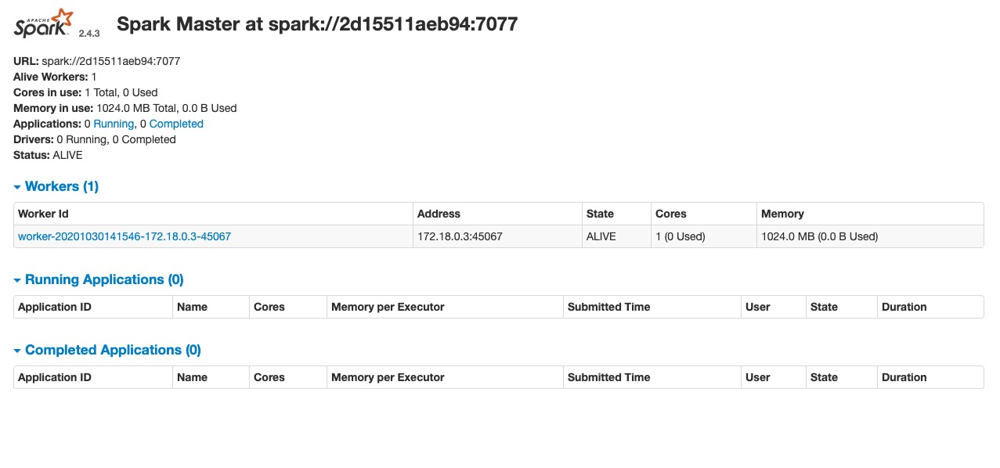
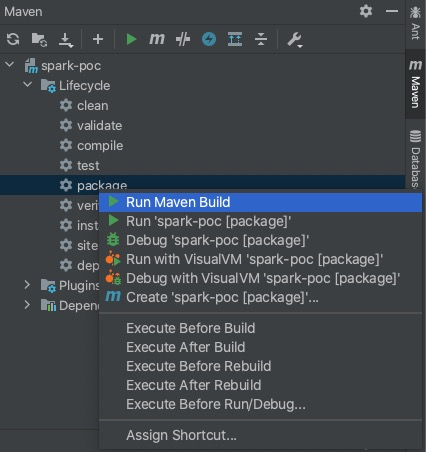
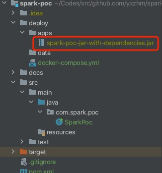
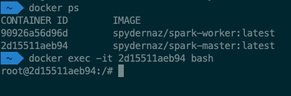
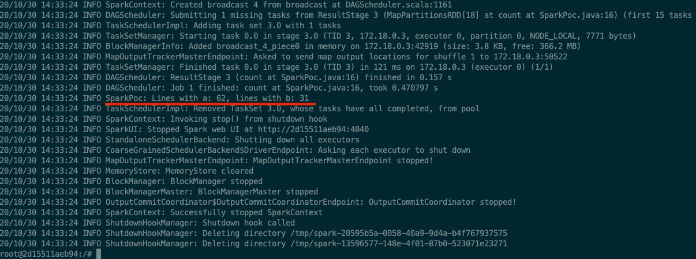
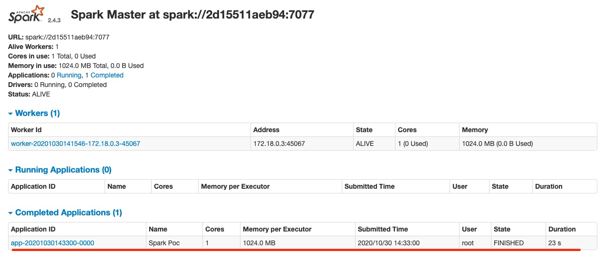

# How to execute this Poc

## The Spark Cluster with Docker

The Spark cluster is the prerequisite. This time we run the Spark with Docker. 

Refer this [mvillarrealb Github Repo](https://github.com/mvillarrealb/docker-spark-cluster)
for the Spark cluster setup. 

Actually, I copied the docker-compose files from above repo into the `deploy` folder of this
 project.

Now, we can run the Spark cluster using below command.
```
docker-compose up --scale spark-worker=1
```
Once the docker containers are running. 

Open the browser and type the http://127.0.0.1:9090/. If the cluster is OK, you should see the
 below Web GUI.
 
 
 
## Compile this Poc Project

I execute the maven build using IDEA IDE.



Once the mvn task is complete. The compiled jar file should be under ./deploy/apps folder.



## Submit the Poc App to Spark

Use `docker ps` and `docker exec` commands to execute the interactive bash shell of Spark master
 container.
 


Run below command in bash shell of master container.

```
/spark/bin/spark-submit \
--class "com.spark.poc.SparkPoc" \
--master "spark://spark-master:7077" \
/opt/spark-apps/spark-poc-jar-with-dependencies.jar
```

If the environment is good. You will see the debugging logs of this Poc in bash shell of master
 container.



Refresh the http://127.0.0.1:9090/. You will see a completed application.

